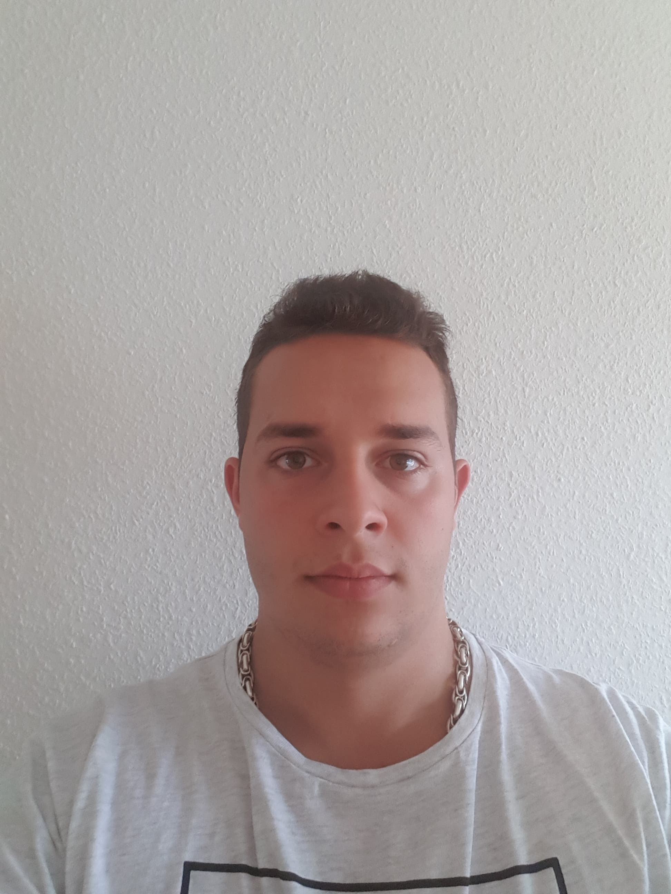

<html>
  <head>
     <link rel="stylesheet" href="me.css">
      <meta name="viewport" content="width=device-width, initial-scale=1">
  <link rel="stylesheet" href="https://maxcdn.bootstrapcdn.com/bootstrap/3.4.1/css/bootstrap.min.css">
  
  
  
  </head>
  <body>

<main>

 
 
    

        

            

                 
                 

                <h1>Valentin Yordanov</h1>

                 
                

            

            

                 
                 
                <h1>Information about me</h1>

<strong>Full name: Valentin Lyudmilov Yordanov</strong>

<strong>Age: 23</strong>

<strong>Previous education: Computer Science</strong>

<strong>Current education: Web Development</strong>

<strong>From: Bulgaria, Varna</strong>

<strong>Hobby: Skiing</strong>

                

            

        

</main>

  </body>
</html>

